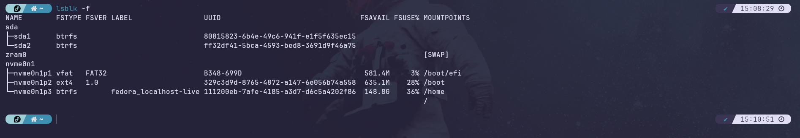
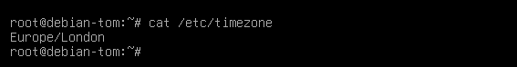
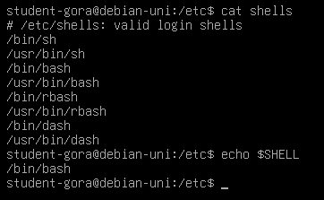

<style>
@import url('https://fonts.googleapis.com/css2?family=Source+Code+Pro&display=swap');
* {
font-family: "Source Code Pro",monospace;
    color: #333;
}

.markdown-body {
        background: #fff !important; 
}

q,
q>*,
code,
pre{
    background: #ddd !important;
}

.source-line:has(q),
.source-line:has(q)>*{
    background: #bbb !important;
    padding: 0.25rem 0.5rem;
    border-radius: 0.25rem;
}

table,
table * {
    background: #fff;
}

table {
    font-size:  0.75rem;
        border-radius: 0.25rem;
}

th {
    background: #ddd;
}

th:first-of-type {
    border-radius: 0.25rem 0 0 0;
}
th:last-of-type {
    border-radius: 0 0.25rem 0 0;
}

tr td:first-of-type {
    min-width: max-content;
    white-space: nowrap;
}

tr:last-of-type td:first-of-type {
    border-radius: 0 0 0 0.25rem;
}

tr:last-of-type td:last-of-type {
    border-radius: 0 0 0.25rem 0;
}

.hljs-keyword {
    color: #B4637A;
}
</style>

## Tomasz Gora - B01665261

##### COMP09024 - Unix System Administration (Paisley Cohort)

## Q1

#### Q1.1

<q>Name and explain ONE qualifier selected by you for each of three commands</q>

Command qualifiers, more commonly referred to as flags are strings added after a command, but before the arguments and are used to invoke certain
behaviour of the command, or set some of its options. They usually begin with a `-` for shorthand single letter flags (those can but don't have to
be concatenated) or `--` for full lenght verbosely worded flags. I.E.

> `rm -rf some_file.txt`  
> `chromium --app=https://gmail.com`

<code>From the commands used in the lecture:</code>

> man --no-hyphenation

Will change formatting of the output of man search to not hyphenate words on line wraps

> ls -a

Will list ALL contents of the current directory, including hidden files (which include `.` and `..`)

> pwd -P

If the absolute path contains symlinks, this will avoid them, and print a longer, but physical path.

#### Q2.2

<q>Who are you (= what is your user name) in this setup?</q>

My username is `tomeczku`


#### Q1.3, Q1.4 and Q1.5

<q>What type of information does the command df display?</q>

<q>What is the source device of the filesystem which is mounted at the mount
point /?</q>

<q>What do the Used and Available columns stand for? (remember you can
always read the fine manual with man df)</q>


`df` stands for `disk free` and prints in a nicely formatted table a breakdown of disk space usage for every mounted volume.  
In the case of my system the point where root is mounted would be partition `nvme0n1p3`, and the device is drive `nvme0n1`.  
The `Used` and `Available` columns are self explanatory columns. They show the amount og respectively used and available space
on a given drive. The only thing to note is that this is displayed in 1KB blocks as units, so one million of these equates to 1GB of storage.

#### Q1.6

<q>What directory name is displayed by the pwd command? Give the full name
including the leading /</q>

Commmand `pwd` prints a full absolute path to a current working directory, beginning with `\`


#### Q1.7

<q>Use man ls to find out what information is given by ls -l? Figure out which
column shows file size (Tip: file1 created by the touch command should be
empty, therefore taking up no space!). What is the size of the newly created file,
file2?</q>

According to pwd's manpage:  
`-l                         use a long listing format`  
what this means `ls -l` will display extended file metadata as a table. This by default includes:

- permissions string
- number of hard links (default is 1 for THIS listed object)
- size in blocks
- creation or last modification date
- name

#### Q1.8 Q1.9 and Q1.10

<q>Use the pwd command to find out what happened and in which directory you
currently reside? What is the meaning of the double dot .. if used in conjunction
with the cd command? (Tip: the command prompt may give you a hint as well)</q>

<q>Use the pwd command to find out what happened and your current directory.</q>

<q>To which directory did the command: cd move you?</q>

With `..` I just navigated to a parent directory.  
With `.` I am able to reference the current directory so I do not need to use the absolute path. Residing in my home directory
and using a path like `./subdir` I am referencing it and from this point I go down to `subdir`.  
When a complete listing (`ls -a`)
is performed in a directory, it can be seen that every dir contains at the very top of the list
entries `.` and `..`. These are not exactly files, but entries that are, to use a reference to modern understanding of objects,
sort of like mandatory fields in a directory objcect "prototype". They allow navigating the filesystem tree, they are pointers to locations.
`.` points to the current directory itself and `..` points to its parent directory. Every directory must have such pointers, else traversal
would not be possible, just like in any linked data structure. At least this is how I understand it.

#### Q1.11

<q>Are there any hidden files in the root directory called /?</q>

No, there are no hidden files in root. There are, as mentioned above, `.` and `..` but those are different kind of entries that aren't files.
(Worth noting, in root both of them reference the root location. It is not possible to traverse up from root).

#### Q1.12

In the case of my system there are 21:  
`boot        dev  home  lib64       media  opt   root  sbin  sys  usr
bin  btrfs_pool  etc  lib   lost+found  mnt    proc  run   srv   tmp  var`

or, to be more precise 17, as Fedora chose to just substitute 4 with symplinks to unify theym with
they equivalents in `/usr/`. These are: `bin sbin lib lib64`.

---

---

## Q2

#### Q2.1

<q>Which version of the Linux kernel is your Linux system running, based on the
files you can see in /boot?</q>

Currently I am on Fedora 39 Kernel 6.15 (as of 21/09/23)
Fedora by default stores copies of recent kernels for easy "soft rollback" on boot from grub menu by booting into system using previous kernel.


#### Q2.2

<q>Can you find another file in /bin containing a binary for a command you have
already used?</q>

Bin contains common (mostly gnu) unix utils. All commands typed in a shell are just executables looked up from /bin. Either directly or symlinked.


#### Q2.3

<q>What is the name of the main hard disk, and how many partitions does it
have?</q>

In my case two physical drives. SDA is a spare sata SSD used for backups and VMs, then main system sits on nvme, and then there is my swap space.
The spare disk I partitioned into 2 parts, then the main one contains default structure of swap and 3 others: efi, boot and main filesystem.




#### Q2.4, Q2.5 and Q2.6

<q>Which kind of device files represent disks and their partitions?</q>

<q>Which kind of device files represent TTYs?</q>

<q>One of the TTY devices belongs to a different user from the others. Which
user, and why do you think this is?</q>

The files in /dev represent actual or "virtual" pseudodevices. They are used to interact with hardware via drivers baked in the kernel that interface with them
by writing to those files. Not everything is real today, as modern computers do not interface via multiple actual physical terminals, nor the x server handle
multiple connected displays, but regardless if a device is a Device with a capital D so to speak, or a "device" the legacy representation and interaction model
is maintained as standard, just as standard input and output allow computers to work and devices to communicate. Depending on the mode of writing data to the device
we can distinguish between **character and block devices**. When listed this is represented by the first letter prepending the line just before permissions.
Disks are therefore block devices and terminals are character devices (makes sense, you type one char at a time).
One of them is assigned to the current regular system user. It provides an interface for user interaction with the shell.
It "pretends" to be that physical terminal connected to the mainframe. Terminal emulator the user runs on their system is a userspace "window"
allowing to look at that viertual terminal. Bear in mind that the question asks "why do I think this is", and since I never specifically read about this
I am just providing my best guess explanation based on the knowledge I have.


#### Q2.7

<q>Which three directories in /usr have names corresponding to directory
names at the top / level?</q>

> /usr/bin/  
> /usr/sbin/  
> /usr/lib/

would be the answer for many traditional Linux distributions. In my case, Redhat tweaked Fedora slightly. All binaries are placed in
/usr/bin/ && /usr/sbin/ and libraries in /usr/lib/
while the equivalents in root are only symlinked to them. This can be seen below:


#### Q2.8

<q>Which directory in /var is used for storing log files?</q>

> /var/log/

#### Q2.9

<q>Which directory in /home belongs to the student user?</q>

Not the case on my personal machine that I use in place of school provided VM, but the normal expectation would be that the user named `student`
would have their corresponding home directory located in `/home/student/`

#### Q2.10

<q>What does the -p to mkdir do?</q>

As per mkdir's manpage:

`-p, --parents   no error if existing, make parent directories as needed, with their file modes unaffected by any -m option.`

In simple terms allows to make a directory anywhere, just provide the path and if needed mkdir will create declared parent directories.
Will not overwrite anything that exists. If you create a dir in home, it will not recreate/overwrite existing home directory of course.

#### Q2.11 and Q2.12

<q>Check the contents of the dir1, dir2 and dir3 directory. What is found in each?</q>

<q>Which directories could you NOT remove, and why?</q>

I do not have access to the directory on a school machine, but I assume this is about the three situations that can ocur when attempting to `rm` a direcotry.

- No directory is empty (at least `.` and `..` are present) and `rm` will not allow removing a directory with content. The recursive flag is required to allow
  the program to traverse the directory structure down the nodes (like in binary trees and other tree data structures) and remove both directory and everything in it.

- User has no write permissions or there is some problem. We just want to remove the directory, no questions asked. The force flag will just send it
  into the void without prompting (-r flag still needed for a dir)

- User is not owner of directory. Elevating privilages like with `sudo` are needed, or root/admin intervention.

#### Q2.13

<q>What happens when the last paramter of the cp command is a directory?</q>

Very similar situation to `rm`. We are affecting the filesystem and creating a new inode for the copy:


By that logic `mv` command does not require the recursive flag, as the inode stays the same (somehow counterintuitively) it is just a reference to it that gets
written to its new parent node.

#### Q2.14

<q>Which of the two links has the same i-node number as the original file?</q>

Hard links do. This is literally a duplicate node byte by byte on a drive along with all its metadata.

#### Q2.15

<q>The owners, permissions and timestamps of a file are stored in its inode.
Where is its name stored?</q>

In the data contained by the parent directory node of the file (where it is located)
The directory stores a table (basically key-value pairs) of its chilren names to corresponding inode numbers.

#### Q2.16

<q>Which (if any) of the links are still working after penguins.txt is removed?</q>

Symlinks are just references so they would break. Hard links are actual duplicates with the same inode number. Same data, same metadata,
only different physical bytes on the medium. The hard link would still work, as it has ALL components of the original file.

#### Q2.17

<q>Does rm dir2 work, when dir2 is an empty directory?</q>

No. Answered in Q2.11/12 response.

#### Q2.18

<q>What files are left in your home directory, and why?</q>

Oh no, I am not running rm -rf \* anywhere anywhere in my home directory for this course ;)

#### Q2.19

<q>Write down the permissions for the /etc/fstab and /etc/shadow files on
your system, and explain why the latter is more heavily restricted.</q>

(**NOTE**: I have the long listing command aliased to `ll`)

Both files are owned by root so obviously need elevated privileges being system files.

For /etc/fstab file:

> user can read and write to it
> members of group (in this case sudoers) and anyone else can read it
> no execution permissions for anyone

For /etc/shadow file:

> Nobody has any permissions to do anything with this file.


#### Q2.20

<q>Use the ls -l command to find out what the default user, group and
permissions are for a newly created file</q>

On my machine the default mask results in the following permissions when a file is touched in my home directory by me:


I can read and write to it, anyone else regardles of if they are in my group or not, can only read.

#### Q2.21

<q>Is it a good idea to have a 7 as the last digit of the permissions for a file?
What would this allow?</q>

Not the best idea from the security standpoint, as this grants absolute full privilages to anyone. Sounds like Windows or something.

#### Q2.22

<q>What is the most permissive access that you can grant in octal notation?</q>

> 777

Or in symbolic

> ugo=rwx

#### Q2.23

<q>Record the command(s) and directory permissions required for this</q>

(**NOTE**: `\` is used here to eascape my custom aliases and use of `exa` package, to just execute plain `ls`)

> - Remove all permissions for all users for good measure:  
>   `chmod ugo-rwx test_dir` or `chmod 000 test_dir`
> - Give my user read permissions on the directory only:  
>   `chmod u+r test` or `chmod 400 test_dir`
> - Try to list the contents with `ls test_dir` and succeed
> - Try to cd into the directory with `cd test_dir` and fail = no access.
>
> 

#### Q2.24

<q> Record the command(s) and directory permissions required for this</q>

Removing those read permissions is needed and then adding execute permissions on the directory is the way.

> `chmod u-rwx test_dir`  
> `chmod u+x test_dir`


#### Q2.25

<q>What is the initial umask value?</q>

The initial umask value on most Unix-like systems is typically set to 022 (in octal notation) for user accounts.


#### Q2.26

<q>If you wanted to keep the umask setings for user and group owners, but
ensure that any files you created were entirely inaccessible by anybody beyond
your group, which umask setting would you use?</q>

Well, the umask works by subtracting bit value from default (usually) `777` for directories and `666` from files.
Therefore to keep default respective 7 and 6 for user and their group I would use 0 to not mask any of those bits,
then I would use 6 to set outhers' permissions to 0(they can still traverse directory because mask will keep execute
permissions on directories structure but not list, open, edit nor write any file)

The answer is: `006`.

#### Q2.27

<q>What is the mount point of the the filesystem stored on the /dev/sda1
device?</q>

For the school system I would not know and I am also not sure how much access is given to students. Are they virtual machine
systems, are they containers is it WSL? I am not entirely sure how it works in WSL, but I would imagine the first partition
might be an efi or boot partition. If WSL hides core system partitions from users maybe it is just root partition.
In my case sda devices are secondary drive, and main drive is nvme, first partition on that one is efi.


#### Q2.28

<q>What is the type of the filesystem mounted from the /dev/sda1 device?</q>

If that's efi it will be FAT, if boot EXT and root I would guess EXT as well, but this can vary. There are various filesystems
supported by unix these days (couple onb linux or bsd, apple has their filesystem for macos devices...). Traditionaly EXT,
ext4 being the latest. In my case it is btrfs (Fedora default).

#### Q2.29

<q>A message appears as the filesystem is mounted. What is special about the
CDROM filesystem which has been mounted?</q>

Oh shoot. I haven't use a CDrom in like a decade or maybe more than 15 years. Obviously it cannot be written to and
the filesystem must be something else to writeable disks. I read just now that is apparently a filesystem called an "ISO 9660".

#### Q2.30

<q>Which of these commands don't succeed, and why?</q>

Any command entailing writes or any alterations to data will fail, but I presume `cp` operations from CD to drive are fine.
Just not `mv` and anything that entails modifying filestructure of a CD as it is obviously not possible.

#### Q2.31

<q>What command can be used to unmount the CDROM filesystem?</q>

I would presume it is the same case as any other mounted drive

`sudo umount /media/cdrom0`

in the case described.

#### Q2.32

<q>What is its device name?</q>

If VirtualBox is anything like QEMU virtual drives should be `vda` devices.

#### Q2.33

<q>Name at least two other types of filesystem which the base Debian
installation is capable of creating. (you could use the TAB key or look for man pages
to find the answer)</q>

Tricky, as I have no experience with Debian, but I will try to answer in a general way.
Well it needs to be able to create FAT drives for EFI or wite entries to existing EFI partition for dual-booter.
I would imagine the installation script is making use of `mkfs` and makefs shoudl be capable of making more than 2 filesystems.
Of course ext4 and legacy EXT systems, NTFS maybe for compatibility with Windows devices. Btrfs for new stuff and even older
legacy things like minix and dos filesystems are also probably possible, but for installation I would say at least FAT systems
for EFI and EXT for boot/root is the minimum.

#### Q2.34

<q>The filesystem you just mounted has been mounted with two options,
relatime and rw. What does rw mean?</q>

It just means the mounted drive has read and write capabilities and operations are performed in real time ( no scheduling).

#### Q2.35, Q2.36, Q2.37

<q>Which field specifies the device name (or label) containing the filesystem</q>

<q>What is specified in the second field?</q>

<q>What are specified in the fourth field?</q>

Device label (like sda1) can be found in the first field, the second is a mount point, then the device type and finally
its config options (which may vary depending on the device).

---

---

## Q3

#### Q3.1

<q>What happens?</q>

On server `alt+F1`, usually throught to `F6` would open ttys (virtual terminals) that connect to the same system. When I do that
in a desktop environment, window manager or any GUI overlay, it will switch to tty interface, leaving the GUI. This is commonly
known as "being dropped to tty" and can be helpful for recovering when GUI environments crash or experience some sort of work-preventing fault.

#### Q3.2

<q>What is the username shown by whoami on tty2?</q>

This could be simulated locally with two instances of terminal emulator running.


However, I went an extra mile and spun up Debian 12 in a VM to emulate pure tty server experience.


#### Q3.3

<q>Why do you think the root user needs to be in less groups than the student
user?</q>

Because gropus are mostly used for bulk management of system permissions for multiple users, and root by its nature
has permissions typically unrestricted, therefore it does not need this granular control.

#### Q3.4

<q>What are the UIDs of the root and student users?</q>

Those can be found for instance in `/etc/passwd` file. Each line corresponds to a user.  
Typically users with UIDs < 1000 are system users, and actual human users get assigned integers >= 1000.  
Unix convention dictates that root will have UID 0.


#### Q3.5 and Q3.6

<q>What is your current group, and which groups are you a member of?</q>

<q>Use ls -n to check the GID for the users group. What is it?</q>

The current group name and number for my user are default. The name is the same as UID, which is in my case
`student-tom` and the default number for first non-system user is 1000.  
The GID for `users` is 100.


#### Q3.7

<q>What is the difference in operation between these two uses of su, and why?</q>

Well, root can do pretty much all it wants, so it can "become" any user without any authentication with just `su $user_name`,
whereas using just `su` allows regular users to "become" a super user - root, but since you are a mere mortal asking to
enter the Olympus of Unix domain, you need to know the root password to access this power ;)

#### Q3.8, Q3.9, Q3.10, Q3.11 and Q3.12

<q>Which field contains the username?</q>

<q>Which field contains the UID?</q>

<q>How is the default group when the user logs in specified?</q>

<q>Which field contains the user's home directory?</q>

<q>What does the last field specify?</q>


The username is shown in the first field. UID in the third. The default group is specified by GID in the fourth field.
Then the sixth field lists the user's home directory location with absolute path string and finally the last field
is a path to a default shell used by the user. Fields are separated by `:` delimiter.

#### Q3.13

<q>Who is the owner and what are the permissions on the /etc/shadow file?
How does this affect what you just tried to do?</q>


  
I imagine this can be configured differently on different systems by default as most things in Linux.  
I.E. My fresh unmodified install of Debian has read and write permissions for user and read permissions for group.
It is owned by `root` abd group `shadow`.

On the other hand my main Fedora system shows the shadow file is owned by both
root and the root group and nobody, even owner, has any permissions to do anything about it.

#### Q3.14

<q>Which of these three commands will tell you how long a user has been
"idle"?</q>

Command `pinky` prints the idle time of a user in the fourth column, per logged in user.

#### Q3.15

<q>Where is root's home directory?</q>

Root has its home folder designated to `/root` location in a typical linux system.

#### Q3.16

<q>Where do normal UIDs start on a Debian GNU/Linux system?</q>

Regular users IDs are integers that increment up from 1000.

#### Q3.17

<q>What is the name of the file where group passwords are stored?</q>

Group passwords are typically stored in the /etc/gshadow file in unix-like systems.

#### Q3.18

<q>Unlike some other operating systems, Unix does not send any characters to
the screen when typing in passwords. What advantage is there to this over (for
example) the Windows default of showing asterisks?</q>

It prevents from giving away any visual clues, even the lenght of a password to the third parties, as it is being typed in.

#### Q3.19, Q3.20 and Q3.21

<q>Which UID and GID will this user have?</q>

<q>You will be asked for information to fill one field in the /etc/passwd file -
which field?</q>

<q>Which other information do you have to provide?</q>

I have added a user named `tomasz`:  


As mentioned above, new users UIDs will increment from 1000, so this one is effectively 1001.

Field five in `/etc/passwd` is a custom field, that various distributions of Linux may utilise in various ways of skip,
but typically this would be some additional user info. In the case of Debian the script will ask for full user name, room number,
work and home phone numbers and other info, then store this info in field five, delimited by `,` characters.

All the other fields are autogenerated.

#### Q3.22

<q>Which of the following does useradd create, by default: line in /etc/passwd
with UID, a user-private group, a password, a home directory with skeleton files?</q>

All of those except for a password, that is manually provided by the user.


#### Q3.23

<q>What is the effect of the useradd -D -s /bin/bash command? Other than
creating a new user, how can you check this?</q>

This does not actually create a new user. With those flags it modifies how `adduser` will work by default.
`-D` flag is reponsible for setting the new default and with `-s` flag a path to a new default shell can be provided.  
After running `sudo useradd -Ds /bin/bash` the command is configured to use bash as default shell for new users.

As for checking it, running `sudo useradd -D` will print to the screen currently set environment viariables,
where we can see `$SHELL` is set to the value we have set up as default.

#### Q3.24

<q>Examine a long listing of the /home directory. What does userdel NOT do
by default? What flag to userdel would have done this?</q>

`userdel` will not delete the user directory in `/home` by default. To have it done by this command a flag `-r` is needed.

#### Q3.25

<q>Both the adduser command and the usermod command can be used to add an
existing user to an existing group. Which forms would the adduser and usermod command have to do this?</q>

It mostly boils down to syntax. `sudo adduser $user $group` is simpler and rolls off the tongue almost like plain English with
grammatical direct object preceeding indirect object. Add this and that user to this and that group.

`sudo usermod` can do many modifications and its function needs specifying with additional flags. In this case they are `-a` and `-G`.
They denote adding to a group action. Also, the order of arguments that this command takes is reversed. Group first, then user.


#### Q3.26

<q>What are the first three "permission" characters of this file? (/usr/bin/passwd)</q>

`-rwsr-xr-x` is the permission string. Read and write for user are self explanatory.
`s` in place of `x` indicates the setuid permission for the owner of the file.
When setuid is set on an executable file, it means that the program will be executed with the permissions of the file's owner,
not the person running the program. In this case, /usr/bin/passwd is a setuid program that allows users to change their own passwords
without needing superuser privileges.

#### Q3.27

<q>Use the ls -ld /tmp directory to document how a world writable directory
with the sticky bit set is shown by ls -l.</q>

The permission string is `drwxrwxrwt`

`/tmp` is a special directory where anyone can write temporary files and which is always flushed when system is closed.
However, allowing anyone to be able to change totally anything is a security risk, therefore there is a special permission type
used in folders like this, where multiple users can modify things freely. It encapsulates that freedom saying in this directory, anyone
can do all things but only on the files the they own themselves. The sticky bit is only for directories, is set in place of `x` and is denoted by `t`.

## Q4

#### Q4.1, Q4.2, Q4.3 and Q4.4

<q>What is the difference between ps and ps -ef?</q>

<q>Explain the meaning of the column headers UID, PID, PPID and CMD</q>

<q>Write down the command names of at least two processes that have the PPID
of 1 (the init process)</q>

<q>Does the ps process list itself? If yes, what is its PID on the system?</q>

Bare bones `ps` prints minimum two processes. Shell and the process(es) running in in at the time of invoking `ps`.
With flags as per the command's help page:

> -A, -e all processes

> -f full-format, including command lines

So these flags allow the maximum output. Listing all the processes and all the info about them.

**UID** - user ID of the user who run the process.  
**PID** - process ID  
**PPID** - parent process ID, references PID of the process that spawned the process in question.  
**CMD** - command associated with the process

Examples of processes spawned by the init system `systemd`

> (In my virtual machine's case at least) `lightdm` display manager, basically login screen in modern times where
> there is no multiple displays talking to one x server.

> `cupsd` scheduling process for cups service (printing system on unix used on linux, macos)


`ps` process lists itself of course. It is not a persistent process and is being terminated after it runs, as on each
listing it appears once and each time has a new PID.


#### Q4.5

<q>What does the sleep command do?</q>

`sleep` can take time as argument and create a job that does nothing, but causes the execution to hang for a given amount of time
(seconds by default). Often used in scripting, in loops, to create delays. It is a bit like prototypical implementation of asynchronous code.

#### Q4.6

<q>What does the & sign do to the sleep command? (Tip: what happens to the
prompt?)</q>

Appending ` &` after the command runs it in a background, in practice "decouplig" th process from the shell session where it was invoked.
User can then continue using the terminal emulator and run other software, because the I/O channels are not being occupied by the background
process running. Myself, apart from scripting use, I would for instance often use this on daily basis when working in CLI and needing to run
something in GUI. Often I would invoke `nautilus . &` or `thunar . &` to open the current location in GUI file manager, or `gimp some_image.png &`
to edit a file and not have the terminal output blocked by the logs that normally would be printed into the console when invoked process runs.

#### Q4.7

<q>When running a process in the background, two numbers are printed, one in
square brackets (the job number), and another one. What is the second one?</q>

The number in brackets is the reference job number assigned to this particular job (useful for managing them from the command line
when they are in the background) by this particular process. The long number is the PID of the process spawned by the command.

#### Q4.8

<q>What is the PID and PPID of the running shell and the two sleep processes?
What is the relationship between them?</q>


In this case `727` is the PID of the shell process (spawned by parent 517) and the sleep jobs are identified by PIDs `779` and `780`.
The relationship is of course that the shell is their parent process. Both their PPIDs reflect this, being `727`.

#### Q4.9

<q>What message does a process send if it ends "naturally"?</q>


It sends to the screen a line that consists of [job number] Status(Terminated, Killed, Stopped...) and a process command.

#### Q4.10

<q>What is the difference between using Ctrl-C and Ctrl-Z to stop a process?</q>

Ctrl-Z sends the process to the background (inspect with `bg` and bring to the foreground with `fg`),
while Ctrl-C attempts to close the program very gracefully. It will ask politely with interrupt signal (2) to stop work, clean memory and then exit.
This signal is "softer" than 9 and 15.

#### Q4.11

<q>What keystroke in top is used to send a signal to a process?</q>

I daily use `btop` or at least `htop` for visual clarity, and the basic functionallity in `top` is the same.
'k' is used to send the kill signal to a process.

#### Q4.12

<q>What command line would you use for vmstat to provide a sequence of 5
pictures of system performance at 2-second intervals?</q>

`vmstat 2 5`

#### Q4.13

<q>How can you make it executable? (the script)</q>

Using `chmod` at least user bit for executable needs being set. Various options with octal notation,
but at least `chmod 100`. Without affecting existing permissions `chmod u+x` will do even better.

#### Q4.14

<q>What percentage of the available CPU power is it taking up, according to
top?</q>

Well this jobs runs a million turns loop writing incrementing integers into a black hole that is `/dev/null`.
It is going to take up some amunt of power and thankfully the instructions don't ask unsuspecting GUI-using students
to write a nested or recursive loop.

On Debian VM it climbed up to over 30% and on my main system was only surpassed
by the very same VM doing said crunching. To my suprise CPU usage managed to beat entire gnome shell (famous for bloat),
both browsers firefox and even ferdium (instance of chromium used for web services).
This is why GPU farms crunch data for crypto-miners and AI instead of CPUs ;)


#### Q4.15, Q4.16, Q4.17 and Q4.18

<q>What are the highest and lowest pririty values shown by top, and how do
these relate to the "nice" values?</q>

<q>Which cruncher process uses the most of the CPU time, and what is its nice
value?</q>

<q>What are the lowest nice values you see on the system?</q>

<q>What is the lowest nice value you can give to a cruncher, as a normal user?</q>

The highest priority value (PR) shown by top is typically -20. The lowest priority value (PR) shown by top is usually 19, but cruncher manages 39.


In my case the first two managed to get nice values of 10 but the third got scheduled with 19 which corresponds to lowest priority.
It might be because CPU was already very busy by the time it run.

The relationship between nice values (NI) and priority values (PR) is as follows:

- Lower "nice" values correspond to higher priority values (lower PR values).
- Higher "nice" values correspond to lower priority values (higher PR values).

20 is the lowest possible and lowest occuring nice value (high priority).
This is also the lowest possible value a user can assign with `nice` and `renice`.

#### Q4.19

<q>What are represented by the real, user and system times?</q>

Real time is actual real-life time the process used to run from start to completion.

User - The time above minus time used by the kernel processes that might have got involved in the execution chain and any other unrelated time like waiting for data etc.
Only user-space processes' time is counted towards this field.  
Only system kernel level process time is counted towards this field.

#### Q4.20

<q>Which times would you expect to be similar if you ran cruncher twice in
parallel? Test your predictions and comment.</q>


## Q1

#### Q1.1

As expected, the nicer process took a bit of a backseat and returned results slightly slower.
It is not that prominent on a modern system that is not doing any other work but the difference is there.

#### Q4.21

<q>How would you display the date in traditional European form? (dd/mm/yy)
What if you wanted to include the full day of the week at the beginning?</q>

Users can pass a string to a date command to tell it how to parse the output like this: `date +"%d/%m/%y"`
and instead of default the formatted string will be returned.


#### Q4.22

<q>What is the value stored in /etc/timezone?</q>

It just stores the system's configured timezone as a plain text string. Possibly one of the cimplest config files ever.



#### Q4.23, Q4.24, Q4.25 and Q4.26

<q>What would the five "time fields" in a crontab be to run a command at 12
noon on New Year's day</q>

<q>What would the five "time fields" in a crontab be to run a command at 8:30
in the morning each weekday?</q>

<q>What would the five "time fields" in a crontab be to run a command at ten
to midnight on the first Sunday of each month?</q>

<q>Read the man page for crontab. Which file could you create as system
administrator in order to turn off the cron facility for all normal users?</q>

Cron job to run this command at 12 noon on New Year's Day `0 12 11 1 1 * date >>/home/student/datenow.txt`.

Cron job to run at 8:30AM each weekday (no weekends) `30 8 * * 1-5 date >>/home/student/datenow.txt`.

Cron job to run at 10 to midnight every first Sunday of each month can be done by passing an expression to evaluate by the command.
If the day date of the next day minus the day date of today is less than 7 then it must be the first Sunday (either 0 or 7 as weekday number is read as Sunday):
`50 23 * * 7 [ "$(date +\%d -d tomorrow)" -le 7 ] && date >>/home/student/datenow.txt`

#### Q4.27 and Q4.28

<q>As which user are the hourly, daily, weekly and monthly cron scripts run?</q>

<q>At what time of day are the jobs in /etc/cron.daily run?</q>

Those scheduled reoccurring jobs are typically run by root user.

By default, on many Debian-based systems, the daily cron jobs are scheduled to run at 6:25 AM local server time.
This is the case on my system as well:


#### Q4.29

<q>Which command allows a user to remove their crontab?</q>

'crontab -r' When a user runs this command, it removes their crontab file, effectively deleting all the scheduled jobs associated with that user.

## Q5

#### Q5.1 and Q5.2

<q>What appears on the screen and why? What ends up in the file h.lst, and
why?</q>

<q>What has happened to the contents of h.lst, and why?</q>

  
Nothing appears on the screen (apart from the new prompt) because the command output has been written to the `h.1st` file.

#### Q5.3

<q>What is the difference between the single (>) and double (>>) output
redirection operator?</q>


`>` overwrites the file contents, while `>>` appends content on a new line.

#### Q5.4, Q5.5 and Q5.6

<q> What happens to stdout and stderr in each case? Document your answer in
a table.</q>

<q>What do you think the operator 2>> would do? Test your theory. Were you
right?</q>

<q>What's happened to the output? What does /dev/null do with data written
to it? (man null might help if you are unsure)</q>

Prerequisite: `hello` and `hello.txt` exist in the working directory.
<br>

| Command                                                    | Stdout                                                                                                         | Stderr                                                                                                                                                                                                                                                                         |
| ---------------------------------------------------------- | -------------------------------------------------------------------------------------------------------------- | ------------------------------------------------------------------------------------------------------------------------------------------------------------------------------------------------------------------------------------------------------------------------------ |
| `ls -l hello.txt hello`                                    | Output of the command is being sent to terminal emulator to be shown on the screen                             | No error s                                                                                                                                                                                                                                                                     |
| ` ls -l hello.txt hello >h1.lst`                           | Output redireted into a file                                                                                   | No errors.                                                                                                                                                                                                                                                                     |
| ` ls -l hello.txt hello 2>h2.lst`                          | Output sent to the terminal emulator and displayed on screen as only errors are being redirected to a file     | No file error, so file created but is empty.                                                                                                                                                                                                                                   |
| ` ls -l hello.txt hello nonexistent_file 2>h3.lst`         | Output sent to the terminal emulator and displayed on screen as only errors are being redirected to a file     | Missing file error, written to a file.                                                                                                                                                                                                                                         |
| ` ls -l hello.txt hello nonexistent_file 2>h4.lst >h5.lst` | Output sent to h5.lst                                                                                          | Missing file error sent to h4.lst.                                                                                                                                                                                                                                             |
| ` ls -l hello.txt hello nonexistent_file &>h6.lst`         | Successful output redireted into a file..                                                                      | ...and because this time process runs in the background the error that normally would end up on the screen gets redirected as well. If this was to be run in the foreground, the following syntax would be needed to capture both streams at once: `command 2>&1 target.file`. |
| `ls -l hello.txt hello >h7.lst >h8.lst`                    | Output redirected to the end of the chain file - h8.lst. The h7.lst file created but no content written to it. | No errors.                                                                                                                                                                                                                                                                     |


If `2>>` operator is used it appends the stderr message on a new line.


When data is sent into the void located in `/dev/null` it is gone. It is a file located in the `/dev` direcotry, where device files (virtual devices as well) live and are used
for interfacing between userspace and hardware drivers. I like to imagine that `/dev/null` is a smart shredder wired to the computer, that just gobbles up and destroys data ;)

#### Q5.7

<q>What is the output of this command? (tr a-z n-za-m <hello.txt)</q>

Command `tr` effectively does a Ceasar's cipher here. Takes 21 ranges of letters `a-z` and `n-za-m` (where `za` defines a join of two ranges `n-z` and `a-m` so we effectively loop around the aplhabet again )
and replaces letters of given indexes from the first array to letters of the same index from the second. So it shifts characters by 13 positions. If run again on the output it will reverse back to the original output,
because the English alphabet has 26 letters. I would argue this example is therefore a quite special case engeneered to look like the tool mixes up the output and then translates back, but it is not really exactly what it does.

#### Q5.8

<q>What is the default block size used by dd? How could you change it?</q>

Using flag `bs` that stand for byte size. As per the man page of `dd`:

> bs=BYTES

              read and write up to BYTES bytes at a time (default: 512); over‐
              rides ibs and obs

and

> N and BYTES may be followed by the following multiplicative suffixes:

       c=1, w=2, b=512,  kB=1000,  K=1024,  MB=1000*1000,  M=1024*1024,  xM=M,
       GB=1000*1000*1000,  G=1024*1024*1024, and so on for T, P, E, Z, Y.  Bi‐
       nary prefixes can be used, too: KiB=K, MiB=M, and so on.  If N ends  in
       'B', it counts bytes not blocks.

Example use to read a block of 10MB:
  


#### Q5.9

<q>By default dd takes input from stdin and sends output to stdout. Which
operands would allow you to specify the filenames directly, rather than using
redirection as above?</q>

Using flags `if` and `of` that stand for input file and output file. As per the man page of `dd`:

> if=FILE

              read from FILE instead of stdin

> of=FILE

              write to FILE instead of stdout


#### Q5.10, Q5.11, Q5.12 and Q5.13

<q>What flag/argument would print addresses in hexadecimal format?</q>

<q>What flag/argument would print data one byte at a time in hexadecimal?</q>

<q>What flag/argument would print data one byte at a time as an ASCII
character?</q>

<q>What do you notice about the ordering of bytes when they are displayed with
-t x2. How could you change this using the --endian flag? (If you're not sure
what "endianness" is, you can look it up!)</q>

For formatting the addresses - flag `-Ax` where `A`:

> -A, --address-radix=RADIX

              output format for file offsets; RADIX is one of [doxn], for Dec‐
              imal, Octal, Hex or None

and `x` passes the hexadecimal format.


For printing single bytes in hex - flag `-t x1` where `t`:

> -t, --format=TYPE

              select output format or formats

and `x1` passes the hexadecimal format one byte at a time.


For formatting single bytes in ASCII - flag `-t c` where `c` formats as characters.


Regarding "endianness". I am not strong in knowledge of the low level stuff, but from what I read it all boild down to a difference
in how binary data is encoded between so called big-endian and little-endian systems
(the latter of which is most commonly used in modern computing.
Not only in x86 but also in ARM which I confirmed running this very experiment in termux on my android phone).
These have to do with order of storing bytes in a memory address. To greatly simplify one is a reverse of another and affects how data is read.
So when bytes are read sequentially they appear in order, but when in pairs it looks like the latter of pair is read first. Apparently it has something
to do with its significance. I am not going to claim that I fully understand this, but when I force listing format to show bytes as they would be stored
in a big endian system with `--endian=big` flag the bytes will be displayed in the same order as when reading one by one.

    Little-e (default on x86 and on ARM)

  
  

Big-e  
  


#### Q5.14

<q>Which Linux device provides true random bytes guaranteed to contain
sufficient entropy?</q>

`/dev/urandom` stands for "unblocking random" device and this is the one that will NOT wait for true entropy (although some physicists
might say it would take till the heat death of the universe, so not really optimal ;)). Jokes aside, we only consider our computing system,
not the system being the universe, and in this frame of reference `/dev/random` will wait for sufficient entropy to gennerate truly random output.

#### Q5.15

<q>Which key in more allows you to search for a string (or regular expression)?</q>

The first thing before I even consider using `more` will always be checking `which less` and if the machine does not have `less`
I will begrudgingly utilize `more` with its forward only navigation and forward only search. The keybinding is standard for forward search `/`,
just like in vi, vim and neovim. Sadly, it lacks `?` for backwards search.

#### Q5.16 and Q5.17

<q>Based on what you see (and maybe what you can find out with some man
commands), what do you think the zcat and groff commands do? (zcat /usr/share/man/man1/man.1.gz | groff -man -T ascii | more)</q>

<q>What happens if you leave out the -T ascii flag in the above command?
Do you recognise the format produced?</q>

When man command is called these tools are what is called behind the scenes to display man pages to the user. Documents are stored in `usr/share/man` in compressed form.
`zcat` accesses the content without actually uncompressing the file, then output is being piped into `groff` which is a core GNU util for reading plain text and producing
formatted output, such as PostScript, PDF, HTML and crucially for terminal emulators ASCII output.

If `-T ascii` flag is omitted, the output will default to PostScript and for this old generic Adobe document format will be sent in plain-text to the terminal.
From there we can read everything, starting with metadata of the document in its header marked by `%%`:

```
%!PS-Adobe-3.0  // metadata confirming it is postscript
%%Creator: groff version 1.22.4  // output of groff
%%CreationDate: Mon Oct  2 09:18:26 2023  // timestamp
%%DocumentNeededResources: font Times-Roman // font declarations
%%+ font Times-Bold
%%+ font Times-Italic
%%+ font Symbol
%%DocumentSuppliedResources: procset grops 1.22 4
%%Pages: 10  // document formatting etc...
%%PageOrder: Ascend
%%DocumentMedia: Default 612 792 0 () ()
%%Orientation: Portrait
%%EndComments
// ...rest of document data...

```

#### Q5.18

<q>What value does the exit status have after each of these commands? What
do these values mean? (Hint: the "EXIT STATUS" section of man grep may help</q>

`$?` is a special system variable storing the latest exit status of the process that run and exited directly beforehand.  
There is a long list of possible exit status values but some of the most important and the ones we examined are:

> 0 Success  
> 1 Operation not permitted  
> 2 No such file or directory  
> ...

#### Q5.19 and Q5.20

<q>Which of the echo commands runs, and why?</q>

<q>Which of the echo commands runs, and why?</q>

In the first question therefore only the first echo statemen will run, in the second question only the second echo statement will run.

#### Q5.21

<q>Create a table with a row for each of the conditional operators && and || and
the following columns:
Does cmd2 if cmd1 returns zero exit status?
Does cmd2 if cmd1 returns non-zero?
What is exit status of overall command if cmd1 returns zero exit status?
What is exit status of overall command if cmd1 returns non-zero exit status?
Complete the columns on the basis of your experiments.</q>

| Conditional Operator | Does cmd2 if cmd1 returns zero exit status? | Does cmd2 if cmd1 returns non-zero? | Exit Status of Overall Command if cmd1 returns zero exit status | Exit Status of Overall Command if cmd1 returns non-zero exit status |
| -------------------- | ------------------------------------------- | ----------------------------------- | --------------------------------------------------------------- | ------------------------------------------------------------------- |
| &&                   | Yes                                         | No                                  | 0                                                               | 1                                                                   |
| \|\|                 | No                                          | Yes                                 | 0                                                               | 0                                                                   |

The conditional operators `&&` and `||` behave similarly to the logical operators `AND` and `OR` in traditional programming languages.
When using `&&`, the cmd2 is executed only if the cmd1 returns a success exit status of 0. In this case, cmd2 acts as if it follows an `AND` logic, requiring both conditions to be true for execution.
On the other hand, when using `||`, cmd2 is executed only if cmd1 returns a non-zero exit status. It can be understood as "execute either" and somehow counterintuitively if cmd1 succeeds, then entire
command chain exits immediately with status 0 and command 1 passed the `OR` logic. To translate to a common if statement format purely as a mental exercise:

```javascript
const exitStatus1 = cmd1.getExitStatus();
const exitStatus2 = cmd2.getExitStatus();
const stderr = cmd2.getStderr();
if (exitStatus1 === 0 || exitStatus2 === 0) return 0;
else {
  console.log(stderr);
  return 127;
}
```

#### Q5.22

<q>Use grep to filter the output of the ps -ef command, and search for a process
containing the string init. Provide the full (pipelined) command line which will do this.</q>

`ps -ef | grep "init"`


#### Q5.23

<q>What pipelined command could print a list of the files in /usr/bin which
include the regular expression r.s among the permissions string (in other words,
have SUID or SGID set)?</q>

I did slightly improve on the regex as what the question proposes will return any line where r and s show anywhere with anything in between, for instance line with command "xrefresh".

`ls -l /usr/bin/ | grep -E "^-r.s` yields better results, as it strictly looks at the beginning of the line for the pattern of a file with permissions starting from `r`.


It is also worth noting that `egrep` is a quick equivalent to using `grep -E`, provided it is available on the system.

#### Q5.24

<q>Which flag to grep will print only non-matching lines? Which makes the
match case-insensitive? Which will print a count of matching lines? Which (two)
flags will suppress output on stdout and stderr respectively?</q>

> `-v` or `--invert-match` for non-matching results  
> `-i` or `--ignore-case` to enforce case insensitive mode
> `-c` or `--count` to return line count of results  
> `-q` or `--quiet` or `--silent` to supress stdout
> `-s` or `--no messages` to supress missing files stderr. Will however not prevent any stderr prints from the command we piped stdout into `grep` from,
> will work only on stderr produced by grep directly I.E. when file is passed directly into `grep` with no piping.

#### Q5.25

<q>A US state abbreviation is formed of 2 upper case letters. Provide a regular
expression which could match this format. (don't worry about checking its a valid
state!)</q>

This can be done with either standard regex or slightly easier Pearl regex syntax compatibility mode for grep (`-P flag`).

`grep "^[A-Z]\{2\}$ file` where curly brackets need to be escaped

or `grep -P "\b[A-Z]{2\b}` where `\b` denotes a word boundary and conveniently this can, but does not need to be the beginning/end of the line.


#### Q5.26

<q>The file command shows the type of a specific file (or list of files). Provide a
single (pipelined) command which will count how many Perl and Python scripts
there are in the /usr/bin directory. </q>

`file /usr/bin/* | grep -Ec "Pearl script|Python script`


#### Q5.27

<q>What does the -d: flag mean in the first of these commands?</q>

Using `cut` with a flag `-d` allows to specify a delimiter, a char that separates fields in a string. In the case of groups listing it is `:`.
`-f1` then tells `cut` to only output first field from each broken down line.

Using `-c` on the other hand allows to specify how many or how big range of characters to return as output per each line. In the case of `-c1-4` it will return chars 1 through 4 from each line.

#### Q5.28

<q>Create a pipe of the ls -l and cut commands which only lists the
permissions field and the filename</q>

It is a bit of a ham-fisted method, as `cut` is limited a bit. I cannot also use empty space as a reliable delimiter here (some fields like date have " " inside of them), so apparently I can only hardcode the char position where the filename begins.
In my TTY `ls -l  | cut -c2-10,59-` works as depicted below. This is however far from ideal, as it will break down in other teminals, depending on display size, term config (column number) etc.
as the distance from the beginning of the line to the filename filed will vary. I could split the line on " ", but `cut` does not provide an option to then select the last field regardless of its index number.


#### Q5.29

<q>What command could sort the contents of the /etc/passwd file
alphabetically by username?</q>

And here we run into the biggest issue with command line utilities. The absence of any standards for core programs syntax.
Where `cut` used `-d` for delimiter and `-f` for field, `sort` uses `-t` for... a reason(?), and `-k` for key is my guess.
Anyway, after reading up I can provide the command:  
`sort -t: -k1 /etc/passwd`

#### Q5.30

<q>Construct and document a pipelined command which takes the output of
last, selects only the system boot times, and then prints the most recent 5 of
them.</q>

`last | grep "system boot" | tail -n5 | cut -d " " -f4-5, 8-13` works just fine.

> - calling `last` to send its log into stdout
> - grepping for lines that contain "system boot" and sending results down the pipe
> - calling `tail` with `-n` flag to grab the last 5 lines of those and sending them to format with `cut`
> - spliting on " " delimiter and selecting fields 4 and 5 (just for visual confirmation that these are indeed system boot lines)
>   plus fields 8-13 that contain date and only the boot time (no session end time as it's not requested).


#### Q5.31

<q>Construct and document a pipelined command which counts how many
times your system has been rebooted (according to the last logs.</q>

Just a sprinkle of scripting and ansi escape strings (long time favourite from college java programs to make my submission stand out ;) ) added to refine the output:

`reboot_count=$(last | grep -c "reboot") && echo -e "Current reboot count: \e[32m"$reboot_count"\e[0m"`

> - Ouput of `last` piped into `grep` that does the counting of lines containing "reboot" string with `-c`
> - Ouput of this pipe chain stored as a variable
> - `echo` a prompt message with the variable appended, using `&&` logic covered a few questions before.
> - `-e` flag in echo enables interpretation of escape sequences including in TTY.


#### Q5.32

<q>Use the -mtime option to find to get a list of files under /usr/share/doc
which were changed more than 10 years ago. Document the command used.</q>

Small simplification assuming a year is always 365 days.
`find /usr/share/doc/* -type f -mtime +3650`

> - `find` is yet another non-standard use of arguments, as it takes the path first, before options.
> - `*` blob used to match everything in the dir.
> - `-type f` flag allows to select type "file".
> - `-mtime +3650` this flag takes + or - to indicate less than and more than values, then the value that has a singual unit of 24hours. Therefore, we have 10\*365 days.
> - There is quite a few of those +10years files, so for a screenshot the command is being piped into `head` to limit the output to 25 lines.


#### Q5.33, Q5.34, Q5.35 and Q5.36

<q>How large is the debiandoc.tar file, and to whom does it belong?</q>

<q>What does the -t option to tar do</q>

<q>Do the files in the archive use relative or absolute pathnames?</q>

<q>The -v (for verbose) provides additional information about the files in the
archive. What additional information does this inlude?</q>

`debiandoc.tar` belongs to a user who created the archive - in this case "student-tom" user.
This is in comparison to source files that were archived with `tar` that were system documentation and belonged to root.
`tar` is primarily an archiving tool and does not do compression. There might be difference in size due to block arrangement and other factors
(and in fact in my example below the archive is about 85K smaller than the source dir) but a tarball might as well be bigger than the source content.


`-t` flag of `tar` tool reads and lists the archived files, withouth extracting the contents. Adding `-v` makes this output verbose,
akin to the output of `ls -l` (permissions string, owner/group size in blocks, modification date, pathname). It is worth noting that this reveals,
that alhough the archive creator ownes the archive, the files inside retain metadata including original permissions and ownership.


The paths listed by `tar -t` are relative in the context of the operating system (its filesystem root location), but at the same time they are absolute from the root location of the archive.
In the example below `test/` is the root of the archive. This is the path important from the point of view of `tar`.


#### Q5.37 and Q5.38

<q>What is the new name of the archive file, and how large is it now?</q>

<q>What does the `-9` option do?</q>

`gzip` is a compression tool. It is quite a common practice in Linux world to create tarballs to contain collections of files, then use compression on tarball.
The resulting file has two "extensions" suffixed. `.tar` for archive and `.gz` for compressed file. But it is of course not Windows. These have no meaning. The point is the program run
its compression algorithm producing smaller ouptut. In my case a tarball of 930K went dow to 637K.  
This is the highest level of compression indicated by `-9`. Flags from `-1` to `-9` can be passed to `gzip` to indicate what balance to strike between speed of compression and its efficiency.

#### Q5.39, Q5.40 and Q5.41

<q>Why are the `-x` and `-z` flags required? What do they do?</q>

<q>What has happened to the user/group owners of the files? Why do you think
this is? (Hint: permissions)</q>

<q>If you wanted to preserve ownership, permissions and timestamp
information on the files, what flag(s) would you have to use, and who would you
have to be?</q>

`tar` is capable of unzipping and extracting a compressed tarball. It needs to be instructed by the user to know how to process a passed in file.  
`-z` tells it to unzip (un-compress) the contents.  
`-x` stands for "extracting" files from the tarball.

When extracting as regular user `tar` cannot set ownership other than current user without privilages, as the currently logged user cannot set anything "in-place" of any other user.
To retain ownership as stored when creating the tarball, elevated privilages are necessary, as only root can set any metadata of the files to any required value at will. Compare:


Flag used to set `tar`'s behaviour to keep timestamps: `--atime-preserve`
Flag used to set `tar`'s behaviour to keep ownership: `--same-owner`
Flag used to set `tar`'s behaviour to keep privilages: `-p`

## Q6

#### Q6.1 and Q6.2

<q>Which shells are available on your Debian system?</q>  
<q>What is the default shell used by the student user?</q>

**NOTE**: A bit of context. At this point I had system problems relating to virtualisation
causing me to have to spin up a new VM in the process of troubleshooting.
Therefore, from this point the screenshots show a different system and a different user,
although it is still an instance of Debian 12 Bookworm.

Shells available by defauls on my Debian system upon freshly installing it are: SH, BASH, RBASH and DASH
with the BASH shell being the default.
Some other common modern shells are ZSH, POSH, FISH. FISH being somehow controvelsial
due to not aligning with posix compliance, and ZSH being extremely popular as well due to MacOS
adopting is as default and thus driving its adoptionm and development.



#### Q6.3

<q>What key combinations moves the cursor to the beginning or the end of the
line?</q>

- \<C-a\> - st**A**rt of line.
- \<C-e\> - **E**nd of line
- \<C-f\> - one char **F**orward
- \<C-b\> - one char **B**ackward

#### Q6.4

<q>What happens after the first time (you might have to listen for it) and after the
second press?</q>

`<Tab>` provides a tab-completion functionality dynamically adjusting suggestions printed out as the user types.
If there are multiple suggestions bash will not display anything after hitting `<Tab>` for the first time, indicating it is waiting for additional input.
If the user is stil unsure of the command/filename/arg they want to have completed, the second time `<Tab>` is pressed will print all matching commands/options.
If there is just one option however, bash will simply complete the rest of the string upon first keypress.

#### Q6.5

<q>In the above example what would the results of the commands `echo file??`
and `echo file???` be?</q>

The fist command will match `file10` and return its name, the latter command will match nothing and just print the pattern itself as a string.


#### Q6.6

<q>In the above examples, how could you match the two files file1 and file10
only?</q>

Yes.


#### Q6.7

<q>If you log in separately as root (on a different virtual terminal, not by using
su) what additional directories are included in $PATH?</q>


Root has access to `sbin` directories which contains software requiring elevated permissions to run,
as these are system binaries used for administration etc. System binaries directories are owned by root.


#### Q6.8

<q id="six-eight">Thinking back to Lab 4, when you created the cruncher script, why did you
need to type ./cruncher to run it? (Hint: what directory is not in the $PATH
variable)</q>

Well, executable binaries/scripts that are placed in directories added to the user's $PATH shell env variable
can be called directly from shell by just typying their name. Otherwise user has to specify the path to the command
which is done simplest by using relative path from `.` (current directory).


**NOTE**: To prove that this is just a path, not some magic syntax we can demonstrate that absolute
path will work just as well.


#### Q6.9

<q>How could you add a directory to the $PATH variable? Test your answer to
make sure it works! (Remember you can log out and back in again if you mess it up
\- that will start a new shell).</q>

`export` command is the way to go. While it's fun to follow the simplest examples the typical correct procedure is to permanently add required string with a path
by adding your `export` command to the shell's rc file, so it is executed on every shell initiation.
Otherwise it would be needed to export a $PATH or any other shell viariable every time a new tty or gui term is spawned.
It is also not needed to log out and back in to apply shell config.
It just needs to be sourced with `source` command like so:


#### Q6.10

<q>Why might it not be a good idea to include the current directory in $PATH?
(Hint: what if you had changed to somebody else's directory?)</q>

1. Security wise: shell will be able to execute anything executable in any location. It is not hard to imagine a malicious script named
   `ls` placed in a working directory that would be executed instead of normal listing command.
2. Even without any malicious actors or code, it is not advisable as even honest mistakes, typos etc might lead to accidental executing anything in any location.

#### Q6.11

<q>Pipe the output of the env variable into grep to find out which of the above
variables (along with $PATH are environment variables.)</q>


Using the following command: `env | grep -E 'USER|HOME|HOSTNAME|PS1|PATH'` returns only lines for
`$HOME`, `$USER` and `$PATH`. This is because `$HOSTNAME` and `PS1` are not environment variables
but merely shell variables set up for bash without exporting. Shell variables can still be echoed and
can be
accessed via set command (no flags or arguments).


#### Q6.12, Q6.13 and Q6.14

<q>Is this an environment variable? If not, how could you make it into one?</q>

<q>How can you remove a variable once it has a value?</q>

<q>How can you turn an environment variable back into a "normal" shell
variable?</q>

As described earlier, the variable needs to be exported with `export` command and then it becomes an
environment variable. To remove env variables they need to be deleted with `unset` command. To make
it back a regular shell variable they need to be set again, as far as I know.


#### Q6.15

<q>Do you think the version of the environment variable in the subshell is the
same value, or a copy? How could you check this?</q>  
This isn't two pointers pointing to the same region of memory (is what I believe you mean asking if
this is the same value, because before changing it the value is technically the same, equal). The
inherited variable is a copy - a different data in memory. Easy way of
confirming is mutating it from within a subshell and observing it retain original value after
exiting the subshell.


#### Q6.17 and Q6.18

<q>What is the value of the LANGUAGE variable. Is this an environment variable?</q>

<q>How could you go back to using the old value of this variable? (Give two
answers!)</q>

It is, because it can be accessed globally and is in the output of `env` command. This value is used
by programs that may have multiple languages available to control the output's language. `ls` is one
of those programs, same goes for `top`, `df` `man` and many other core GNU utils (generally old
software, with relevance, good maintanance and accessibility standards).

To revert this change we can either unset this variable, and in its absence the system will
fallback to default (English US in this case), as well as/or it can be re-assigned like `LANGUAGE=en_GB`
(if it was unset before, it will need to be additionally exported again).
).


#### Q6.19

<q>List at least 8 characters which have a special meaning to the shell, along
with their meaning.</q>

- `$` - Used to access variable values. The shell interprets the text following the dollar sign as
  the name of a variable.
- `&` - Used to run a command in the background, allowing you to continue using the shell while the command is executing.
- `*` - Represents any sequence of characters (piping). Used for pattern matching in file and directory names.
- `|` - Connects the output of one command as the input to another command. Allows you to create a
  pipeline of commands. Also used as a delimiter in some command's syntax i.e. between multiple
  strings passed as an argument.
- `>` - Redirects the output of a command to a file. Creates or overwrites the content of the
  specified file (if doubled, appends to existing content)
- `<` - Redirects the contents of a file to be used as input for a command (doubled is used for
  in-script delimited input that will be read by bash and passed to the preceeding command, and
  tripled can pass a string in quotes).
- `#` - Indicates the start of a comment. Everything following the hash symbol on a line is treated as a comment and ignored by the shell.
- `?` - Used as a wildcard character in filename expansion. Represents any single character.
- `[]` - Used for character class matching in filename expansion. Matches any single character
  within the specified range or set. Also used as shorthand syntax for `test` command in conditional logic.
- `{}` - Used for brace expansion in shell commands. Generates a sequence of strings based on the
  enclosed patterns. Also seen in looping through lists to access `list[@]` at every index.
- `''` - Preserve the literal value of each character enclosed within the quotes. Suppresses variable and command substitution.
- `""` - Preserve the literal value of most characters enclosed within the quotes. Allows variable and command substitution.
- `\` - Escapes the character following it, preventing the shell from interpreting its special meaning. Used for quoting special characters.

#### Q6.20

<q>What would happen if you left out the \ here?</q>

`echo Fish & chips` will result in shell echoing "Fish" and also trying to execute `chips` command,
while `echo` is run in the background. It will fail, unless the user has some package called `chips`
installed on the system for some reason. I don't think such package exists though.

#### Q6.21 and Q6.22

<q>It is possible to place a single quote in a single-quoted string? What about a
double quote in a double-quoted string?</q>

<q>How would you use the echo command to print a dollar quantity stored in a
variable $price with a dollar sign in front of it?</q>

This can be achieved with escaping (using `\`) but only in double quotes as single quotes prevent
string interpretation and do not respect escaped values. Thus the first two example are interpeted
by echo as "quoted string" + unquoted string + "another quoted string". In the third example, due to
inability to escape chars inside of single quotes,bash interprets it as an incomplete command because the single-quoted string hasn't been closed
properly. Therefore, it prompts with > indicating that it's waiting for more input to complete
the command. Bash sees the following input for echoing: `He screamed \` - first string delimited by
single quotes, then unquoted string `AAAH!'`(escaping works here) then unquoted string continues
with `on his way down the chasm.` then another `'` opens and bash expects it to be closed. The
fourth example is escaping working correctly inside of double quotes, and finally there is escaping
of the `$` character working correctly when printing the price.


#### Q6.23

<q>Explain the operation of whole command line. (`grep student /etc/passwd | cut -f3 -d:`)</q>

Grepping for a line containg string "student" in a file `/etc/passwd` then piping the output into a
cut command that splits the string on `:` delimiter and teturns field number 3 from the resulting
list.

#### Q6.24

<q>Describe the operation of the above command. (`touch log-$(date +%Y-%m-%d).txt`)</q>

This creats a file named `log-\<current date\>.txt` and it achieves that because commands can be
enclosed in value interpretation syntax $() and then the returned output will be treated as input or
argument for the main command. In this case the output of `date` formatter with its
flags is a string gets appended to "log-".

#### Q6.25

<q>Why do you need the ./ in front of the shell script's name?</q>

I believe this has been answered in
<a href="#six-eight"> question 6.8</a>. The script needs a location if it is not in a directory
specified in a path (which is where shell is looking for executables) so the dot simply indicates
path relative to current direcotry.

#### Q6.26, Q6.27, Q6.28 and Q6.29

<q>What are the values of the $#, $0 and $1 variables on your command line,
and do any of these relate to the output of ps -f which describes your current
shell?</q>

<q>What do the $0 and $# variables represent?</q>

<q>What do the $1 and $2 variables represent?</q>

<q>What does the $\* variable represent?</q>

These are the default shell variables used to store and retrieve the command metadata.

- `$#` stores the number of args passed to the command.
- `$0` stores the path the executed binary/script was called from (name extractable with `basename`)
- `$1`, `$2` etc. store the values of subsequent arguments passed to the command.
- `$*` stores all arguments as a single string delimeted by spaces (as typed in the command)

#### Q6.30

<q>If you replace $1 by ${1-default}, what happens when you call your script
without parameters?</q>

Curly braces allow to do kind of parameter expansion (similar to coalescent operator like `??` or
conditional ternary operators in modern languages), which is allowing to conditionally provide a
fallback value if the intended value is not available (null). It is a useful shorthand to handle
erors in bash scripting. It does not need to say "default" anything can be passed in there, like a
different string in the example below:


#### Q6.31

<q>If you put an extra command on a line by itself, shift, right before the first
echo commands, what effect does that command have?</q>

The `shift` command will modify the arguments stored in `$(number)` variables. This will cause the
first value to be discarded and the rest of the arguments will shift by one position. This is useful
in scripts that need to loop over args one at a time.


#### Q6.32, Q6.33, Q6.34, Q6.35 and Q6.36

<q>Summarise what this script does with its parameters</q>

<q>Explain what the effect of the for filename in $\* command is (and how
it relates to do and done)</q>

<q>Explain what the effect of the if, then and fi commands are.</q>

<q>Explain what echo $filename | grep -q '.txt$' does, and why the -q
and single quotes are required.</q>

<q>Explain how the line beginning with backup= works (the man page for
basename might help).</q>

The script takes `*` glob as an argument which stands for "everything in the current location. It
loops over eachfile and if it is a text file it creates .bak backup copy.

As explained above glob pattern as argument will stand for all items in a
location where the script is running (or could be another location if defined, like
`../some-other-directory/*)`. What the script does is just a basic for loop, which is like day one
concept of programing. It iterates over each value passed in a `$*` variable. `do` is just a keyword
in bash syntax to denote the beginning of scope of code to be looped as is `done` - used to denote
the end of this scope.

Similarly, `then` and `fi` encapsulate the codeblock to be executed if condition is met in an if
statemet. `if` denotes the beginning of conditional statement. It is folowed by the condition,
which is followed by `then`, executed action and `fi`, which marks the end of the if block.

The condition that the question is concerned with uses `echo` and `grep` to examine argument we are
currently looping over as a string and pattern match it to ".txt" appearing at the end of this
string. The flag `-q` makes grep to produce output without printing to the console ( equivalent to
--quiet) as it is not needed to visually examine each step of the loop working through files, it
just needs to happen in the background.

As I mentioned beforem, `basename` is used to extract filename from a path string. So,
`backup=$(basename $filename .txt).bak` assignes to a variable `$backup` string value consisting of
a name of the file currently examined in a loop turn and passing the consition, with a ".bak"
extension concateated to it, so it could be used later as a name of the output file.

## Q7

#### Q7.1

<q>What is the difference between the update and upgrade subcommands to
apt-get?</q>

It is worth noting, that modern `apt` syntax has been updated and simplified to use `apt` only as
package command, in contrast to legacy `apt-get`.

- `apt-get update` or `apt update` This subcommand updates the local package index. It retrieves information about
  the latest available packages and their versions from the distribution's repositories (and/or
  other repos defined in apt's config).
- `apt-get upgrade` or `apt upgrade` This subcommand installs the latest versions of all installed
  packages on the system according to locally stored index obtained from the updating command.

In a nutshell, the correct practice is to first sync apt's configuration with the state of remote
repositories and only then run an upgrade.

#### Q7.2

<q>Did your system keep back packages? Which packages were installed by
dist-upgrade?</q>

It so happens that my VM was fully up to date and not needing any upgrades. I tried to check if I
could test it on my VPS but it was just the same. Debian is not Arch after all and changes are infrequent.


#### Q7.3

<q>List at least three packages which appear to provide a web server.</q>

- `httpd` (http deamon), the original, is not to be found in its form in any modern repos, but
  deserves an honourable mention as this was the first ever software written for the prototype web
  developed at CERN to serve linked documents on request.
- `apache2` is still and extremely popular open source server used for instance in good old LAMP
  stack.
- `nginx` is another, highly popular server, different in implementation, architecture and
  configuration structure, but similarly old and stable. In fact, both hail from the time around
  mid-naughts, when modern Web 2.0 was being born, with asynchronous request
  paradigm invention, jQuery and Rails release and Google gaining popularity. Therefore, both can be
  considered very mature technologies that power a lot of today's Internet.
- `lighttpd` is another alternative serving static content. Although it is somewhat less popular
  it is still widely used in embedded applications due to its being light and fast.
- There are many different packages serving web content, not necessarily over the Internet. One
  noteworthy mention from me as a web developer is a very prelevant npm package called
  `live-server` used to spin a web server running on the local machine and serving content via
  localhost, providing various conviniences like hot-reload of the page on file save, for improved developer
  experience.

#### Q7.4, Q7.5 and Q7.6

<q>What virtual packages does the apache2 package provide?</q>

<q>On which other packages does apache2 depend (or "pre-depend")?</q>

<q>Which version of the apache2 package is available?</q>

**NOTE:** Again, apt has a modern consise syntax for this: `apt show` equivalent to `apt-cache
show`.


- Packages provided with Apache2: `httpd httpd-cgi`
  - `httpd` still used as a unix name for the main server deamon runninng to provide the core functionality of serving content and responding to requests.
  - `httpd-cgi` is a service providding integration with the system like allowing apache to run scripts etc.
    on the machine.
- Apache2's dependencies are: `init-system-helpers apache2-bin apache2-data apache2-utils lsb-base
media-types perl procps`

  - `init-system-helpers` a set of scripts used in integration with the init system.
  - `apache2-bin`are packaded binaries used by the server.
  - `apache2-data` is data files needed by the server like configs and other default static files
    etc.
  - `apache2-utils` as the name suggests colection of various other utilities that are needed but
    are not core packages
  - `lsb-base` Linux Standard Base is a core Linux library used to standardise the operation of
    Apache on a Linux machine.
  - `media-types` a library of mimetypes (simplifying - file types)
  - `perl` is Perl language
  - `procps` is a library of utilities for monitoring system processes, necessary to even log server
    processes failures etc.

- The version of Apache2 available from the Debian repos at the time of writing is **2.4.57-2**.

#### Q7.7

<q>Use apt-cache show to find out what this package does, and how much
space it will take up (in KiB).</q>

A core GNU util (Richard Stallman approves as long as it is being run on GNU/Linux ;) packaged for
Debian. It prints "Hello, world!" to the console and takes 53.1kB of downloaded size; 284kB of local
space after installing. (Which boggles my mind because it is C, while entire minified modern JS
libraries come up to React 40-something kB or Solid 7kB). Until just now I never realized, that
compiler might introduce such big size overhead in trade of performance. I am sorry, end of
digression here.
